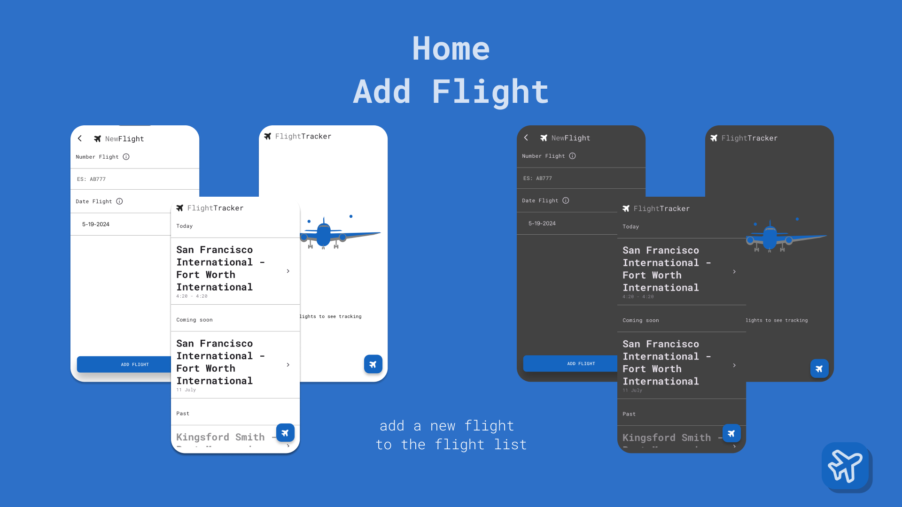
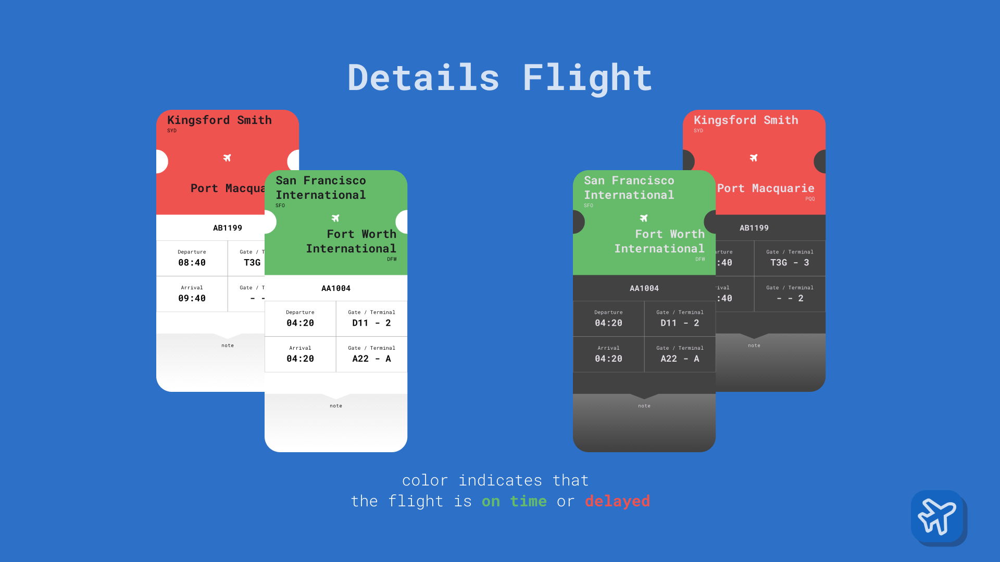

#  Flight tracker


An app to check the status of flights. The default implementation use the json data in local. The data is storage in `asset/data.json`. If run project in Windows or web change the local storage because this implementation use `sqflite`.

## Credits

- **Argument projects**: [Fudeo](https://www.fudeo.it/)
- **API Flight Scanner**: [AviationStack](https://aviationstack.com/)
- **Font**: [Google fonts](https://fonts.google.com)
- **Illustration**: [undraw](https://undraw.co)

## Run project
move in project
```bash
cd flightTracker
```
### Generated file
commands for generating files:
```bash
dart run build_runner build --delete-conflicting-outputs
```
commands to generate translations:
```bash
flutter gen-l10n
```
run
```bash
flutter run ios
```

### Aspect




