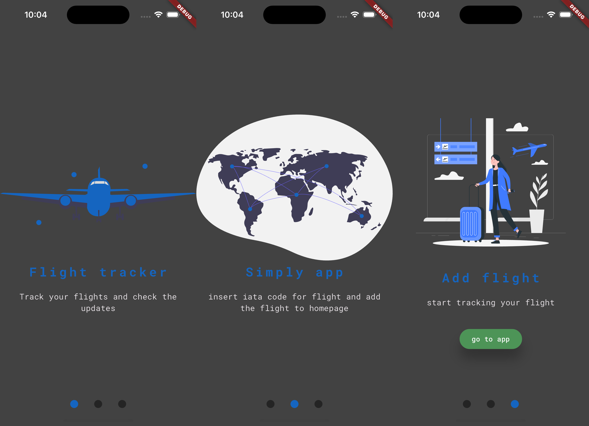
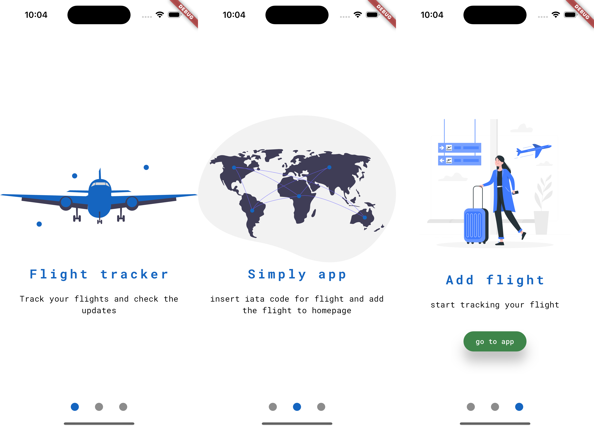
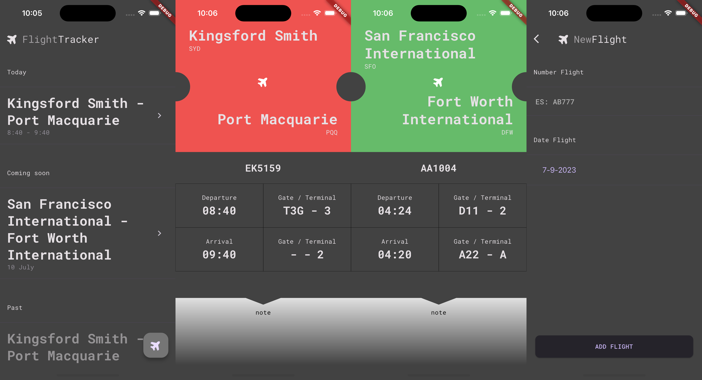
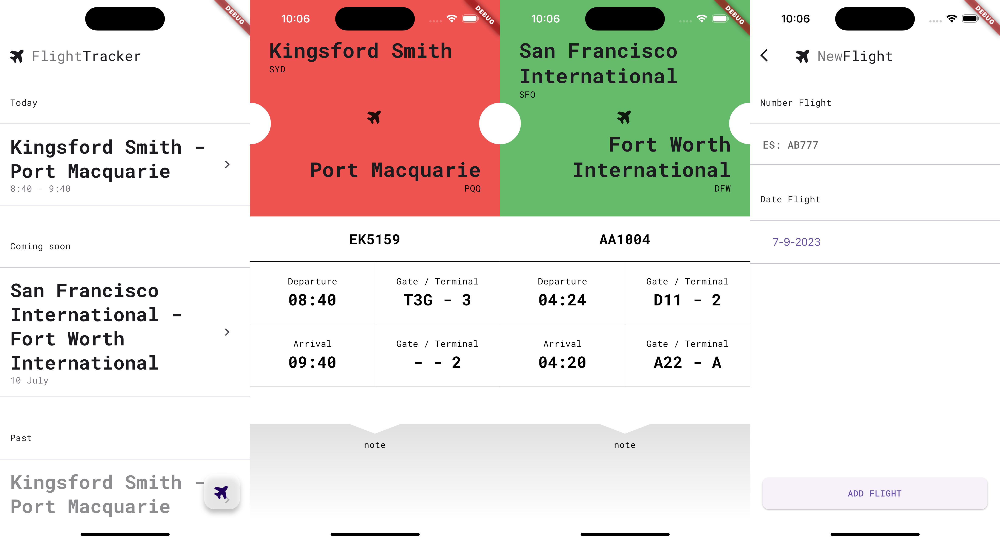

#  Flight tracker

An app to check the status of flights. The default implementation use the json data in local. The data is storage in `asset/data.json`. If run project in Windows or web change the local storage because this implementation use `sqflite`.
## Credits

- **Argument projects**: [Fudeo](https://www.fudeo.it/)
- **API Flight Scanner**: [AviationStack](https://aviationstack.com/)
- **Font**: [Google fonts](https://fonts.google.com)
- **Illustration**: [undraw](https://undraw.co)

## Run project
(mac command)
```bash
git clone https://github.com/BrachettaMatteo/flightTracker.git
cd flightTracker
Flutter run ios
```
### Aspect




