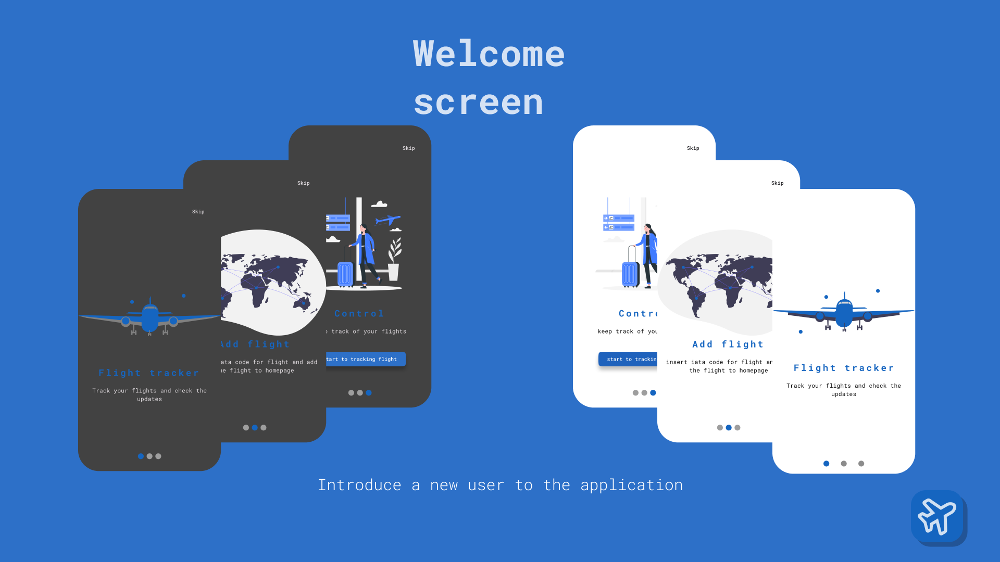

<p align="center">
  <a href="https://github.com/BrachettaMatteo/flight_tracker_app">
    
  </a>
</p>
<h1 align="center">
  Flight Tracker App
</h1>
<p align="center">
     
    <a href="./LICENSE.md">
    
    </a>
     
    
</p>

<p align="center">
  An app to check the status of flights.
</p>

## Description

The Flight Tracker application is an application to help track flights and follow its updates. The interface is simple and essential. It implements the following features

- _Onboarding_: to help the user understand the application and its functionality;
- _Homepage_: to track flights, they will be divided into three lists: future flights, flights departing today, and past flights;
- _Add flight_: through the IATA code, it will be possible to easily add the flight;
- _Multilingual_: it is available in English and Italian;

## Run project

> The default implementation use the json data in local(`asset/data.json`), if you get data for api implement `FightTrackerApiRepository`. If run project in Windows or web change the local storage because this implementation use `sqflite`.

clone and move in directory

```bash
git clone https://github.com/BrachettaMatteo/flight_tracker_app.git
cd flight_tracker
```

```bash
#generate automatic file
dart run build_runner build --delete-conflicting-outputs
#generate translation
flutter gen-l10n
#run project choice ios or android
flutter run ios
```

### Aspect




## Credits

- **Argument projects**: [Fudeo](https://www.fudeo.it/)
- **API Flight Scanner**: [AviationStack](https://aviationstack.com/)
- **Font**: [Google fonts](https://fonts.google.com)
- **Illustration**: [undraw](https://undraw.co)
